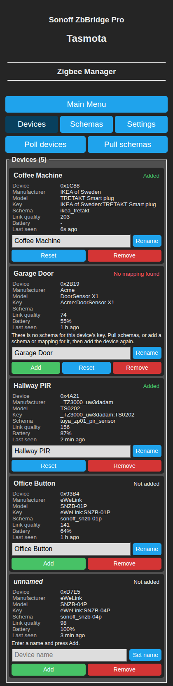
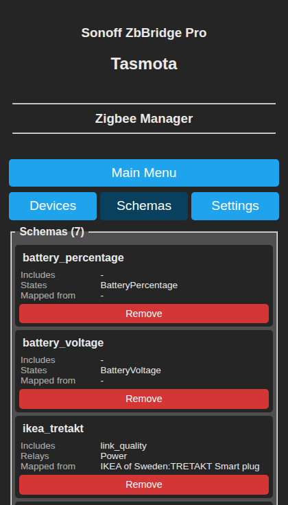
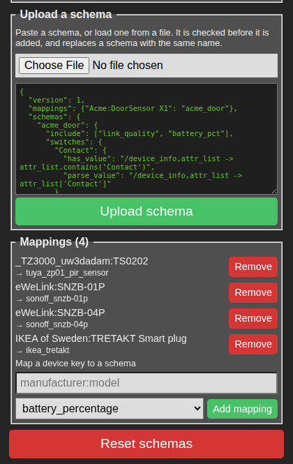
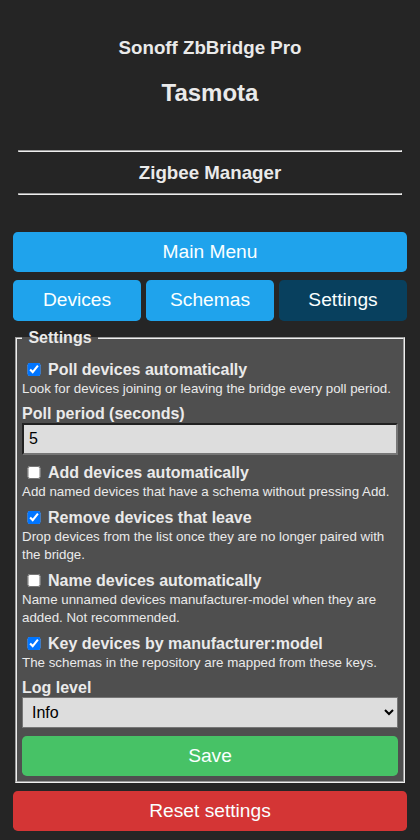

## Zigbee Manager for Tasmota

This extension is meant to implement the Tasmota discovery protocol when running Tasmota on a zigbee bridge, such as the Sonoff Zigbee Bridge Pro. It does this by advertising the zigbee devices as standalone devices on the mqtt `tasmota/discovery/` topics, emitting zigbee device updates to their respective `tele/<device_name>/` and `stat/<device_name>/` topics and, in the case of relays, listening on their `cmnd/<device_name>/` topics.

This is an alternative to Zigbee2MQTT and others such that it keeps all the zigbee communication on device, and translates this to mqtt messages that match any other Tasmotized wifi devices. 

To install this extension in Tasmota, paste the url `https://raw.githubusercontent.com/rmawatson/tasmota-zigbee-manager/refs/heads/main/extensions/` into the field at the bottom of `Tools->Extensions` and install from there.

Once installed, devices, schemas and settings can be managed from the **Zigbee Manager** page in the Tasmota web UI, see [Web UI](#web-ui), or with the [commands](#exposed-commands) in the console.

Primarily this was implemented to allow automatic discovery on Home Assistant with the existing Tasmota Integration, and has been used with a few PIR sensors, contact sensors, temperature/humidity sensors and Sonoff relays (see the `schema/` folder).

## Web UI

The extension adds a **Zigbee Manager** button to the main page of the Tasmota web UI. It opens three pages, **Devices**, **Schemas** and **Settings**, which cover what the `Zbm` commands below do. When a web password is set the pages need admin access.

Each page has **Main Menu** at the top, then a button for each page with the current one highlighted. After any action the page reloads with a message at the top, green when it worked, or red with the reason when it did not.

### Getting a device working

1. Pair the device with the bridge as usual, with Tasmota's **Zigbee Permit Join**.
2. Open **Zigbee Manager**. The device is listed within one poll period (5 seconds by default), or straight away after pressing **Poll devices**.
3. Press **Pull schemas** to download the schemas for your devices from this repository. The result is shown in the console when it finishes.
4. Type a name for the device and press **Add**. It is then advertised over MQTT discovery, and shows up in Home Assistant's Tasmota integration.

If the repository has no schema for the device, see [Creating a schema](#creating-a-schema), then upload it from the Schemas page.

### Devices



Every device found on the bridge is listed, named devices first. Each shows its short address, manufacturer, model, key (`manufacturer:model`), the schema mapped to that key, link quality, battery level (`-` for mains powered devices) and when the bridge last heard from it, with its status in the top right.

- **Rename** (or **Set name** for an unnamed device) names the device with `ZbName`. Renaming a device that is already added adds it again, so its MQTT topics move to the new name.
- **Add** (`ZbmAddDevice`) is shown for every device that is not added. A name typed into the box is set first, so an unnamed device can be named and added in one go. Add also clears the errors left by an earlier attempt, so it can be pressed again once a missing schema has been added.
- **Reset** (`ZbmResetDevice`) clears the device's status. **Remove** (`ZbmRemoveDevice`) removes it, after asking.
- **Poll devices** (`ZbmPollDevices`) looks for devices joining or leaving the bridge now.
- **Pull schemas** (`ZbmPullSchemas`) downloads the schemas for every device from this repository, including devices that are already added, as their schemas may have been updated. The button shows *Pulling schemas...* until it has finished.

When a device is not added, a hint below its details says what to do. The statuses are

| Status | Meaning |
|---|---|
| Added | Working, its messages are processed and published over MQTT |
| Not added | Found on the bridge but not added yet, press Add |
| Device unnamed | It needs a name before it can be added |
| No mapping found | No schema is mapped to the device's key. Pull schemas, or upload a schema or add a mapping for it, then press Add |
| Schema not found | The key is mapped to a schema that is not in the registry |
| Schema compile failed | The schema could not be used: one of its functions does not compile, a schema it includes is missing, or a relay has no `set_value`. The reason is logged with `log_level` 3 |
| No default key available | The device has not reported its manufacturer and model yet, so it has no key |
| Device not found | The device is no longer paired with the bridge (only listed when *Remove devices that leave* is off) |
| Device was removed | Removed from the manager, press Reset to be able to add it again |

### Schemas



Lists the schemas in the registry, each with the schemas it includes, its entities by category and the device keys mapped to it. **Remove** removes a schema (`ZbmRemoveSchema`), devices mapped to it stop working until another schema is mapped to their key. **Reset schemas**, at the bottom of the page, removes every schema and mapping (`ZbmResetSchemas`).



**Upload a schema** adds a schema pasted into the box, or loaded into it from a `.json` file. Nothing is stored until it has been checked, and it is rejected, with the reason, when

- it is not valid JSON, or its `version` is not the registry's
- it does not follow the schema layout, for example an unknown category, or an entity without any function
- one of its functions does not compile
- it includes a schema, or maps a key to a schema, that is neither in the registry nor in the same upload

A rejected schema stays in the box so it can be corrected. The upload shown above is rejected with *Schema rejected, acme_door includes battery_pct, which is not in the registry*. An accepted schema replaces any schema with the same name as a whole, and added devices using it are configured again so the changes reach Home Assistant.

**Mappings** lists the schema used for each device key. **Remove** removes a mapping (`ZbmRemoveMapping`), and the form below adds one (`ZbmAddMapping`), suggesting the keys of devices that do not have a mapping yet.

### Settings



Changes the values otherwise set with `ZbmConfig`. **Reset settings** puts them back to their defaults (`ZbmResetConfig`).

| Setting | `ZbmConfig` key | Default | |
|---|---|---|---|
| Poll devices automatically | `auto_poll_devices` | on | Look for devices joining or leaving the bridge every poll period |
| Poll period (seconds) | `auto_poll_devices_period` | 5 | From 1 to 3600 |
| Add devices automatically | `auto_add_devices` | off | Add named devices that have a schema without pressing Add |
| Remove devices that leave | `auto_remove_devices` | on | Drop devices that are no longer paired with the bridge from the list |
| Name devices automatically | `auto_name_devices` | off | Name unnamed devices `manufacturer-model N` when they are added. Not recommended |
| Key devices by manufacturer:model | `auto_key_devices` | on | Needed to use the schemas in this repository |
| Log level | `log_level` | Info | None, Error, Info or Debug. Use Debug when looking into a problem |

## How it works

All devices must be named, and have a key. The key is generated automatically as `manufacturer:model` (`auto_key_devices`), so only naming the device with `ZbName` is required. When a device is added, the zigbee manager uses this key to look for a matching mapping in its registry. The mapping associates that device key with a schema, which is also in the registry. The schema provides the config and callbacks for processing the zigbee messages, see [Schema functions](#schema-functions).

When a new zigbee message arrives, the device it came from is looked up. If it is added, its schema is looked up, and the message is offered to each entity (relay, sensor, state or switch) of the schema in turn. It is passed to the entity's `has_value`, if it has one. If this returns false, the entity is skipped. Otherwise `parse_value` is called to extract the value, which is then published to the entity's mqtt topic.

| Category | Published to | Value |
|---|---|---|
| `relays` | `stat/<device_name>/POWER<n>` and `stat/<device_name>/RESULT` | A number or true/false becomes `ON`/`OFF` |
| `switches` | `tele/<device_name>/SENSOR` | A number or true/false becomes `ON`/`OFF` |
| `sensors` | `tele/<device_name>/SENSOR`, under the entity's `format_category` when it has one | As returned |
| `states` | `tele/<device_name>/STATE` | As returned |

The `SENSOR` and `STATE` messages hold the latest value of every entity that has had one since the extension started, not only the values from the last zigbee message.

In the case of relays, `cmnd/<device_name>/Power<n>` is subscribed to, with `<n>` counting from 1. A command received there is passed to the relay's `set_value` callback, with 1 for `ON` and 0 for `OFF`. This is expected to write the value to the zigbee device (see `schema/sonoff_minir2.json`).

`request_value` is called whenever the device is configured: when it is added, when the extension starts, when mqtt reconnects, and when its schema is pulled or uploaded again. This is to allow probing of the device to get its current status. For battery operated devices that are not actively listening this will end up doing nothing.

The `reset_value` callback is called straight after `parse_value`. It is intended to allow a reset value to be emitted to the mqtt
topic after the parsed value. In the case of a button, the default home assistant tasmota plugin didn't support the button field of the tasmota discovery message, and will show nothing in the UI.

Implementing the button as a sensor (see `schema/sonoff_snzb-01p.json`) only one zigbee message is received (in the case of the Sonoff snzb-01p and probably others) when the button is pressed. This message always has the same `Power:2` value when the button is pressed. Home assistant ignores this as 'no change' for a sensor, and no event is generated within HA. To work around this `reset_value` can be used to send a 0 straight after the value from `parse_value` has been emitted, creating a pulse that can be used to trigger automations.

`format_category` is required for sensors to show up in home assistant without `format_category` the value for the sensor would be at the root of the json fragment sent to the `tele/<device_name>/SENSOR` topic. This is ignored by the home assistant plugin, apart from a few select sensor fields. With the fragment below both `Pressed` and `LinkQuality` would fail to show in the UI

```
{
  "Time": "2025-11-25T20:10:09",
  "Pressed": 0,
  "LinkQuality": 147
}
```
setting `format_category` for the sensor `Pressed` (see `schema/sonoff_snzb-01p.json`) to `"format_category": "Button"` in the schema will show up in the home assistant UI as a sensor `Button Pressed` as in the json below 
```
{
  "Time": "2025-11-25T20:10:09",
  "Button": {
    "Pressed": 0
  },
  "Zigbee": {
    "LinkQuality": 147
  }
}
```
(This example has also had the LinkQuality sensor's `format_category` set to `Zigbee` (see `schema/link_quality.json`) )

## Creating a schema

Assuming the device is connected to the zigbee bridge,

- Start with a basic schema fragment
    ```
    {
      "version": 1,
      "mappings": {},
       "schemas": {}
    }
    ```
- Find the device's short address with `ZbmDevices`, which lists every device on the bridge with its status
    ```
    01:42:21.120 ZBM: info > status : [<unnamed> (0x120E)] []
    ```
    then show its details with `ZbmDevice 0x120E`, writing the address as `ZbmDevices` shows it
    ```
    01:42:23.460 ZBM: info > status : [<unnamed> (0x120E)]
    01:42:23.462 ZBM: info > status :    manufacturer: SONOFF
    01:42:23.464 ZBM: info > status :          model: ZBMINIR2
    01:42:23.466 ZBM: info > status :      shortaddr: 0x120E
    01:42:23.468 ZBM: info > status :       longaddr: 0x8404CBFEFFB6C67C
    01:42:23.469 ZBM: info > status :            mac: 8404CBFEFFB6
    01:42:23.471 ZBM: info > status :       lastseen: 2025-11-26T00:21:23
    01:42:23.472 ZBM: info > status :            lqi: 149
    01:42:23.474 ZBM: info > status :        battery: -1
    01:42:23.475 ZBM: info > status :            key: nil
    01:42:23.476 ZBM: info > status :         status: []
    ```
    The key the schema is looked up with is `manufacturer:model`, here `SONOFF:ZBMINIR2`. `key` shows `nil` until the device has been added, or adding it has been tried.
- Name the device with `ZbName 0x120E,RELAY-01`.
- Turn on debug logging with `ZbmConfig log_level=3`. ZBM's messages are written at Tasmota's error level, so they show in the console with any `WebLog` setting except 0 (the default is 2).
- Activate your device and watch the console (in the case of the relay press the button)
    ```
    01:47:26.533 ZBM: debug > device_manager : attributes_final,{"Power":1,"Endpoint":1,"LinkQuality":149},4622
    ```
    The zigbee packet is the second item `{"Power":1,"Endpoint":1,"LinkQuality":149}`

- Create the `relay` or `sensor` in your schema. The name for the schema is up to you. The categories are `relays` (published to `stat/<device_name>/POWERn`), `sensors` and `switches` (`tele/<device_name>/SENSOR`) and `states` (`tele/<device_name>/STATE`). Switches do not show anything in home assistant, but the mqtt messages for them work. `commands` is accepted but not implemented yet (see [To do/Notes](#to-donotes)), and any other category, such as `buttons`, is rejected. A button is made with a sensor, see [How it works](#how-it-works). the name of the relay can be whatever you want. Relays are `POWER1` ,`POWER2`, `POWER3`.. in the mqtt messages (but see [To do/Notes](#to-donotes) for devices with more than one relay).
    ```
    {
        "version": 1,
        "mappings": {},
        "schemas": {
            "mysonoff_r2": {
                "relays":{
                    "MyRelay": {}
                }
            }
        }
    }
    ```
- Add any includes from pre-existing schemas that contain features your device exposes (everything seems to have LinkQuality as part of the zigbee message)
    ```
    {
        "version": 1,
        "mappings": {},
        "schemas": {
            "mysonoff_r2": {
                "include": ["link_quality"],
                "relays":{
                    "MyRelay": {}
                }
            }
        }
    }
    ```
- Create the callbacks for processing the messages from zigbee, [Schema functions](#schema-functions) has the details and more examples.
All callbacks are passed the current device's `device_info`, along with the attribute list for `has_value`, `parse_value` and `reset_value`, the value from the `cmnd` topic for `set_value` (1 for `ON`, 0 for `OFF`), or nothing more for `request_value`. All callbacks are passed a `ctx` object as their last argument, with helper functions for sending write and read requests to the zigbee device, `ctx.zb_write` and `ctx.zb_read`.
- In this case, setting and reading the `Power` field is all that is required<br>
`has_value` should return a boolean value as to whether or not the value exists. If it always exists this is not required.<br/>
`"has_value": "/device_info,attr_list -> attr_list.contains('Power')"`<br/>
`parse_value` should return the extracted value, formatted as required<br/>
`"parse_value": "/device_info,attr_list -> attr_list['Power'] ? 'ON' : 'OFF'"`<br/>
- For a sensor no further callbacks are necessary - just a `format_category` in the case of HA. For a relay, `set_value` is needed to write a value from the cmnd topic's mqtt payload. It can use the provided `zb_write` helper function to write this to the relay device.
`"set_value": "/device_info,value,ctx -> ctx.zb_write(device_info,{'Power':value ? 1 : 0})"`<br/>
Note: it may require some experimentation in the console using Tasmota's `ZbSend` to check your relay is working. the `zb_write` `zb_read` functions above are just wrappers around `ZbSend`
- Optionally you can add `request_value` to have Zbm request the latest relay status on startup for this device.
- Your schema should look as below.
    ```
    {
        "version": 1,
        "schemas": {
            "mysonoff_r2": {
                "include": ["link_quality"],
                "relays": {
                    "MyRelay": {
                        "has_value": "/device_info,attr_list -> attr_list.contains('Power')",
                        "parse_value": "/device_info,attr_list -> attr_list['Power'] ? 'ON' : 'OFF'",
                        "set_value": "/device_info,value,ctx -> ctx.zb_write(device_info,{'Power':value ? 1 : 0})",
                        "request_value": "/device_info,ctx -> ctx.zb_read(device_info,{'Power':1})"
                    }
                }
            }
        }
    }
    ```
- Finally add a mapping to this schema. Assuming you want to use `auto_key_devices` to generate `manufacturer:model` keys for your device then using the information from `ZbmDevice` earlier
    ```
    01:42:23.462 ZBM: info > status :    manufacturer: SONOFF
    01:42:23.464 ZBM: info > status :          model: ZBMINIR2
    ```
    add the mapping to the schema
    ```
    {
        "version": 1,
        "mappings": {
            "SONOFF:ZBMINIR2": "mysonoff_r2"
        },        
        "schemas": {
            "mysonoff_r2": {
                "include": ["link_quality"],
                "relays": {
                    "MyRelay": {
                        "has_value": "/device_info,attr_list -> attr_list.contains('Power')",
                        "parse_value": "/device_info,attr_list -> attr_list['Power'] ? 'ON' : 'OFF'",
                        "set_value": "/device_info,value,ctx -> ctx.zb_write(device_info,{'Power':value ? 1 : 0})",
                        "request_value": "/device_info,ctx -> ctx.zb_read(device_info,{'Power':1})"
                    }
                }
            }
        }
    }
    ```
- The schema can now be added to the registry by pasting it into **Upload a schema** on the [Schemas page](#schemas), which checks it and tells you what is wrong if it is rejected, or with `ZbmAddSchema <paste_the_json>`
- Once the schema has been tested and confirmed working it can be added to the repository. Clone the repository, put the schema in the schema folder and run `scripts/update_manifest.py` to update the manifest (used by `ZbmPullSchemas`). Submit a PR. For future use of your schema, `ZbmPullSchemas` should be all that is required to set up your device.

## Schema functions

A schema can have these keys

- `relays`, `sensors`, `states`, `switches` and `commands`, the entities by category, see [How it works](#how-it-works) for where each one is published
- `include`, a list of schemas whose entities are added to this one, such as `["link_quality", "battery_percentage"]`
- `config`, where `battery` and `deepsleep` set the battery and deep sleep flags (`bat` and `dslp`) of the discovery message. The battery powered sensors in this repository set both to 1

Each entity has one or more of the functions below, and a sensor can have a `format_category`. Names of schemas, entities and format categories can contain letters, digits, spaces, `_` and `-`, and mapping keys can also contain `:`.

### The functions

| Function | Called | Arguments | Returns |
|---|---|---|---|
| `has_value` | For every message from the device | `device_info, attr_list, ctx` | Whether the message has a value for this entity. Without `has_value`, `parse_value` is called for every message |
| `parse_value` | When `has_value` returned true | `device_info, attr_list, ctx` | The value to publish, `nil` is published as `null` |
| `reset_value` | Straight after `parse_value` | `device_info, attr_list, ctx` | A second value, published straight after the first |
| `set_value` | Relays only, when a command arrives on `cmnd/<device_name>/Power<n>` | `device_info, value, ctx` | Nothing. `value` is 1 for `ON` and 0 for `OFF` |
| `request_value` | When the device is configured, see [How it works](#how-it-works) | `device_info, ctx` | Nothing |

A relay must have `set_value`, otherwise the device is marked *Schema compile failed* when its first message arrives.

- `device_info` is the device, with `device_info.name`, `device_info.deviceid` (`0x120E`), `device_info.shortaddr` (as a number), `device_info.manufacturer`, `device_info.model`, `device_info.key`, `device_info.lqi` and `device_info.battery`.
- `attr_list` is a map of the attributes in the zigbee message, as shown in the `attributes_final` debug line, such as `{"Power":1,"Endpoint":1,"LinkQuality":149}`. Read it with `attr_list.contains('Power')`, `attr_list['Power']`, or `attr_list.find('Power')`, which gives `nil` rather than an error when the attribute is missing.
- `ctx` has two helpers that send a `ZbSend` command to the device. `ctx.zb_write(device_info, {'Power':1})` sends `ZbSend {"Device":"0x120E","Send":{"Power":1}}`, and `ctx.zb_read(device_info, {'Power':1})` sends `ZbSend {"Device":"0x120E","Read":{"Power":1}}`. The payload can also be a string, as `TurboMode` in `schema/sonoff_minir2.json` does, which is sent as it is, `"Send":"FC11_00/120029"`.

### Writing a function

A function is Berry code in a JSON string, in one of three forms

| Form | Example |
|---|---|
| Lambda, a single expression | `/device_info,attr_list -> attr_list['Power'] ? 'ON' : 'OFF'` |
| Function | `def (device_info, attr_list) var power = attr_list['Power'] return power ? 'ON' : 'OFF' end` |
| Named function, the name is not used | `def power(device_info, attr_list) return attr_list['Power'] ? 'ON' : 'OFF' end` |

- The JSON string is in double quotes, so use single quotes for strings in the Berry code, `attr_list['Power']`.
- A `def` can hold several statements, on one line as above, or on several lines with `\n` between them in the JSON string.
- The parameters can be named as you like, and the ones a function does not use can be left off the end, `/device_info -> device_info.lqi`.
- `tasmota` and `log` can be used anywhere. Modules such as `math`, `string` and `json` are not global in Tasmota, so a lambda that uses one fails to compile with `'math' undeclared`. Import the module inside a `def` instead, `def (device_info, attr_list) import math return math.round(attr_list['Humidity']) end`.

### When something goes wrong

- A function that raises an error, such as `attr_list['Power']` on a message without `Power`, is turned off for every device using the schema, until a schema or mapping is added or removed, or Tasmota restarts. Check for the attribute in `has_value`, or use `attr_list.find`. The error is only logged with `ZbmConfig log_level=3`
    ```
    ZBM: debug > invoke_handler parse_value : key_error,Power
    ZBM: debug > device_manager : an error occurred executing parse_value handler for 4622:mysonoff_r2:relays:MyRelay
    ```
- A function that does not compile, or an include that is not in the registry, gives the device the status *Schema compile failed* when it is added, and the reason is logged with `log_level` 3. **Upload a schema** on the [Schemas page](#schemas) compiles the functions and checks the includes before anything is stored, `ZbmAddSchema` does not.
- To see everything a device sends while working on its schema, log it from a `has_value`, as in the last example below.

### Examples

Each of these is one category of a schema, to go in the schema's entry in `schemas`.

A sensor reading an attribute, from `schema/sonoff_snzb-02p.json`. `{"Temperature":21.37}` sets `"Sensor":{"Temperature":21.37}` in `tele/<device_name>/SENSOR`
```json
"sensors": {
    "Temperature": {
        "has_value": "/device_info,attr_list -> attr_list.contains('Temperature')",
        "parse_value": "/device_info,attr_list -> real(attr_list['Temperature'])",
        "format_category": "Sensor"
    }
}
```

Rounding, with a module imported in a `def`. `{"Humidity":48.6}` sets `"Sensor":{"Humidity":49}`
```json
"sensors": {
    "Humidity": {
        "has_value": "/device_info,attr_list -> attr_list.contains('Humidity')",
        "parse_value": "def (device_info, attr_list) import math return math.round(attr_list['Humidity']) end",
        "format_category": "Sensor"
    }
}
```

A value from `device_info` rather than the message, published with every message, from `schema/link_quality.json`
```json
"sensors": {
    "LinkQuality": {
        "parse_value": "/device_info,attr_list -> device_info.lqi",
        "format_category": "Zigbee"
    }
}
```

Names for numbered values, with a default. `{"Mode":2}` sets `"Mode":"Cool"` in `tele/<device_name>/STATE`, and `{"Mode":7}` sets `"Mode":"Unknown"`
```json
"states": {
    "Mode": {
        "has_value": "/device_info,attr_list -> attr_list.contains('Mode')",
        "parse_value": "def (device_info, attr_list) var names = {0: 'Off', 1: 'Heat', 2: 'Cool'} return names.find(attr_list['Mode'], 'Unknown') end"
    }
}
```

Only the messages from one endpoint. `{"Illuminance":340,"Endpoint":2}` sets `"Light":{"Illuminance":340}`, a message from endpoint 1 is ignored
```json
"sensors": {
    "Illuminance": {
        "has_value": "/device_info,attr_list -> attr_list.find('Endpoint') == 2 && attr_list.contains('Illuminance')",
        "parse_value": "/device_info,attr_list -> attr_list['Illuminance']",
        "format_category": "Light"
    }
}
```

A contact as a switch, from `schema/sonoff_snzb-04p.json`. `{"Contact":1}` sets `"Contact":"ON"` in `tele/<device_name>/SENSOR`, and `{"Contact":0}` sets `"Contact":"OFF"`
```json
"switches": {
    "Contact": {
        "has_value": "/device_info,attr_list -> attr_list.contains('Contact')",
        "parse_value": "/device_info,attr_list -> attr_list['Contact'] ? true : false"
    }
}
```

A button press as a pulse, from `schema/sonoff_snzb-01p.json`. `{"Power":2}` sets `"Button":{"Pressed":3}`, then `"Button":{"Pressed":0}` in a second message
```json
"sensors": {
    "Pressed": {
        "has_value": "/device_info,attr_list -> attr_list.contains('Power')",
        "parse_value": "/device_info,attr_list -> int(attr_list['Power']) + 1",
        "reset_value": "/device_info,attr_list -> 0",
        "format_category": "Button"
    }
}
```

Logging every message from the device, on several lines. It publishes nothing, as `has_value` always returns false
```json
"states": {
    "Log": {
        "has_value": "def (device_info, attr_list)\n    log(f'{device_info.name} sent {attr_list}', 2)\n    return false\nend"
    }
}
```

## Exposed commands

All commands are either read only (ro), read write (rw) or write only (wo). Unless otherwise specified, arguments can be passed

- positionally, `ZbmAddMapping SONOFF:ZBMINIR2,mysonoff_r2`
- as key=value pairs, `ZbmAddDevice devicename=RELAY-01`. Keys and values can only contain letters, digits and `_ - . ( )`, so a name with a space, or a key with a `:`, has to be passed one of the other ways
- as JSON, `ZbmAddDevice {"devicename":"Coffee Machine"}`. It has to be valid JSON, with double quotes, otherwise it is read as a positional argument

A device id is the device's short address in hex, as `ZbmDevices` shows it, `0x120E`.

> ### ZbmDevices (ro)
>
> Lists the devices on the bridge with their status, one per line, such as `[RELAY-01 (0x120E)] ['Added']`

> ### ZbmDevice (ro)
>
> Shows the details of one device, `ZbmDevice 0x120E`, see [Creating a schema](#creating-a-schema). The id has to be written exactly as `ZbmDevices` shows it, with upper case letters

> ### ZbmSchemas (ro)
>
> Shows the current content of the registry in the console (requires `log_level` 2 or more)

> ### ZbmConfig (rw)
>
> Outputs the current config with no arguments, or sets the values given as key=value pairs or JSON, such as `ZbmConfig auto_add_devices=1,log_level=3`. On/off values can be given as `1`/`0`, `on`/`off`, `true`/`false` or `yes`/`no`. The same values can be changed on the [Settings page](#settings).
>
> `auto_poll_devices`<br/>
> Enable/disable auto polling of devices. Every `auto_poll_devices_period` seconds the devices paired with the bridge are listed: new devices are found, devices that left are marked as not found (or removed, see `auto_remove_devices`), and with `auto_add_devices` the devices are added. `ZbmPollDevices` will run the same process manually a single time `default=true`
>
> `auto_poll_devices_period`<br/>
> Polling period for auto_poll_devices in seconds `default=5`
>
> `auto_add_devices`<br/>
> Enable/disable automatically attempting to add a device, at every poll and with every message from it. Until a device is added, no zigbee messages will be processed for that device, and no mqtt messages will be sent. To automatically add a device, it must have a valid name, a key (`auto_key_devices=true`), and a mapping in the registry for its key, to a schema that compiles. `default=false`
>
> `auto_remove_devices`<br/>
> Enable/disable removal of devices that are no longer paired with the bridge. At the next poll they are dropped from the list, and if they were added they are reported Offline first. With this off they stay listed with the status *Device not found*. `default=true`
>
> `auto_name_devices`<br/>
> Enable/disable automatically naming a device (not recommended). This generates a name of the form `manufacturer-model N`. The name is set when adding the device is tried, and the device is added at the next try, such as a second `ZbmAddDevice` `default=false`
>
> `auto_key_devices`<br/>
> Enable/disable generating the key used to look up the device's schema, of the form `manufacturer:model`. There is currently no way to set a key yourself, so with this off devices cannot be added. `default=true`
>
> `log_level`<br/>
> The log level of the zbm extension, 0 none, 1 error, 2 info or 3 debug. Use 3 when debugging any issue, errors in schema functions are only logged at 3 `default=2`

> ### ZbmPollDevices (wo)
>
> Runs the same processing that is run when `auto_poll_devices=true`, once

> ### ZbmAddSchema (wo)
>
> Add a schema to the registry. The schema should be of the form
> ```
> {
>    "version": 1,
>    "mappings": {},
>    "schemas": {
>        "schema_name": {
>            "states": {
>                "SensorName": {
>                    "parse_value": "<berry function>"
>                }
>            }
>        }
>    }
>}
>```
> Note: mappings and schemas are both optional, so you can add a mapping with this, or a schema, or both.
>
> Adding a schema that is already in the registry merges it with the stored one: the entities and functions in the new one replace the stored ones, those only in the stored one are kept, and an `include` list is replaced as a whole. A mapping that is already in the registry is replaced.
>
> The layout of the schema is checked, but its functions are not compiled and its includes are not looked up, so a mistake in them shows up as *Schema compile failed* when a device using the schema is added. **Upload a schema** on the [Schemas page](#schemas) checks both before anything is stored, and replaces a stored schema as a whole.

> ### ZbmResetSchemas (wo)
>
> Removes every schema and mapping from the registry

> ### ZbmRemoveSchema (wo)
>
> Removes a schema from the registry, `ZbmRemoveSchema mysonoff_r2`. Its mappings are kept, so devices mapped to it get the status *Schema not found* when they are added

> ### ZbmResetConfig (wo)
>
> Resets the config to its defaults

> ### ZbmResetService (wo)
>
> Clears the device list, including added devices, which then have to be added again. The devices paired with the bridge are listed again at the next poll

> ### ZbmAddDevice (wo)
>
> Attempts to add a device, by id or by name, `ZbmAddDevice 0x120E`, `ZbmAddDevice devicename=RELAY-01` or `ZbmAddDevice {"devicename":"Coffee Machine"}`. Once a device is added, the zigbee payloads for that device will be processed, and an mqtt discovery topic will be emitted. 'Added' is the working state of a device. Any additional states (as seen using ZbmDevices) is most likely an error. To successfully add a device it needs to have a valid name (or auto_name_devices=true), a key (auto_key_devices=true), and the registry must have a mapping for the device's key, to a schema that compiles. A removed device has to be reset with `ZbmResetDevice` first

> ### ZbmRemoveDevice (wo)
>
> Removes the device either by `devicename=the_device_name` or `deviceid=the_device_shortaddr`. Its messages are no longer processed, it is reported Offline if it was added, and it stays listed as *Device was removed* until it is reset with `ZbmResetDevice`

> ### ZbmResetDevice (wo)
>
> Clears the status of a device, by id or by name like `ZbmRemoveDevice`. This includes *Added*, so an added device is no longer processed until it is added again. It is needed before a removed device can be added again. The schema errors, *No mapping found*, *Schema not found* and *Schema compile failed*, clear by themselves when a schema or mapping is added or removed, so after fixing a schema the device only needs adding again

> ### ZbmAddMapping (wo)
>
> Maps a device key to a schema, `ZbmAddMapping SONOFF:ZBMINIR2,mysonoff_r2` or `ZbmAddMapping {"key":"SONOFF:ZBMINIR2","schema":"mysonoff_r2"}`. The key contains a `:`, so it cannot be passed as a key=value pair. The schema has to be in the registry, and a key that is already mapped has to be removed first (`ZbmAddSchema` replaces it instead)

> ### ZbmRemoveMapping (wo)
>
> Removes a mapping by its key, `ZbmRemoveMapping SONOFF:ZBMINIR2`

> ### ZbmPullSchemas (wo)
>
> For all devices attached to the zigbee bridge, attempts to download valid schemas and mappings from the github repository for them based on the device key (or generated key if `auto_key_devices=true`). For devices that have schemas in the repository, assuming they are all named with `ZbName` already, with default settings this would be all that is required to make them discoverable (and in the case of home assistant they would show up as devices in the tasmota integration)
>
> The download runs in the background, one file at a time, so the command returns straight away with `{"ZbmPullSchemas":{"Status":"Started","Keys":[...]}}`. Schemas are downloaded for every device, including devices that are already added, as the repository may have newer versions, together with the schemas they include. Each downloaded schema replaces the one in the registry as a whole as soon as it arrives (a schema you added yourself under the same name as one in the repository is overwritten), and devices that are already added are configured again so the changes take effect. Failed requests are retried. Once finished the result is logged and published to `stat/<topic>/RESULT`, either `{"ZbmPullSchemas":{"Status":"Done","Schemas":[...],"NotFound":[...]}}` or `{"ZbmPullSchemas":{"Status":"Failed","Error":"...","Schemas":[...]}}`, where `Schemas` lists the schemas replaced before the failure.

## To do/Notes
Entities in `commands` (see `schema/sonoff_minir2.json`) are accepted, and their `request_value` is called, but their values are not published and nothing is subscribed to for their `set_value`. Home Assistant doesn't really have a no code/yaml way to call them, but it would still be nice to listen to the topics to configure things such as TurboMode on the sonoff_minir2.

Devices with more than one relay do not work properly yet. The `Power<n>` numbers are not given in the order the relays are written in the schema, and a state change of one relay can be published under another relay's number. Devices with a single relay are not affected.

the zha repository contains a lot of already found information on devices, for example the minir2, the TurboMode feature's details are described `https://github.com/zigpy/zha-device-handlers/blob/dev/zhaquirks/sonoff/zbminir2.py`
